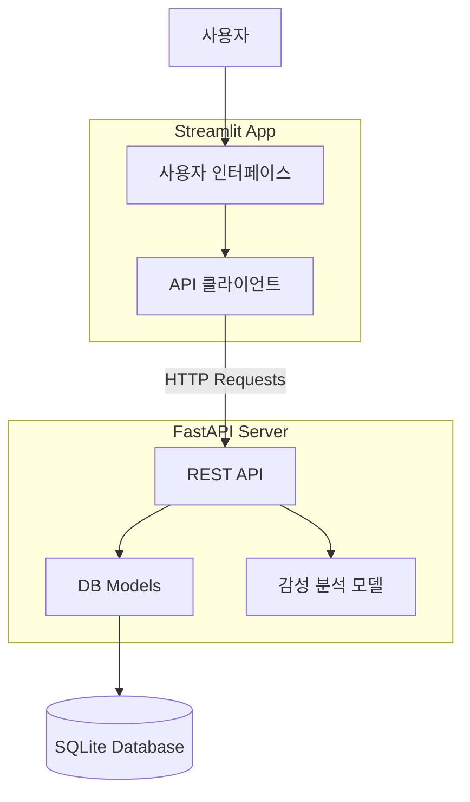
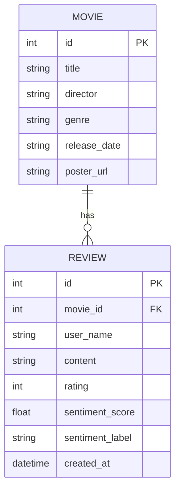

# 프로젝트 보고서

## 1. 서비스 개요
본 서비스는 영화 정보를 공유하고 리뷰를 남기는 커뮤니티 플랫폼입니다. 단순한 리뷰 작성을 넘어, AI 모델을 활용한 자동 감성 분석 기능을 통해 리뷰의 긍정/부정 성향을 즉각적으로 파악하여 사용자에게 시각적인 피드백을 제공합니다.

## 2. 서비스 구조도

## 3. 데이터베이스 구조도 (ERD)

## 4. 백엔드 및 모델 서빙
- **Backend Framework**: FastAPI를 사용하여 비동기 처리가 가능한 고성능 API 서버 구축.
- **Database**: SQLModel을 사용하여 Python 객체와 데이터베이스 간 매핑을 간소화. SQLite를 사용하여 별도 설치 없이 가볍게 운영.
- **AI Model**:
    - 모델명: `daekeun-ml/ko-electra-small-v3-nsmc`
    - 특징: 한국어 영화 리뷰 데이터셋(NSMC)으로 파인튜닝된 Electra Small 모델. 경량화된 모델로 CPU 환경에서도 빠른 추론 속도 보장.
    - 서빙 방식: FastAPI 서버 시작 시 모델을 로드하여(전역 변수), 요청 시마다 재로딩 없이 즉시 추론 수행.

## 5. 프론트엔드
- **Framework**: Streamlit을 사용하여 Python만으로 대화형 웹 UI 구축.
- **State Management**: Session State를 활용하여 영화 목록/상세 뷰 간 전환 상태 관리.
- **Visualization**: 리뷰 감성 분석 결과(점수, 라벨)를 색상과 아이콘으로 직관적으로 시각화.

## 6. 스크린샷
*(실제 실행 화면 캡쳐 후 첨부 필요)*
- 영화 목록 화면
- 영화 상세 및 리뷰 화면
- FastAPI Swagger UI 화면
